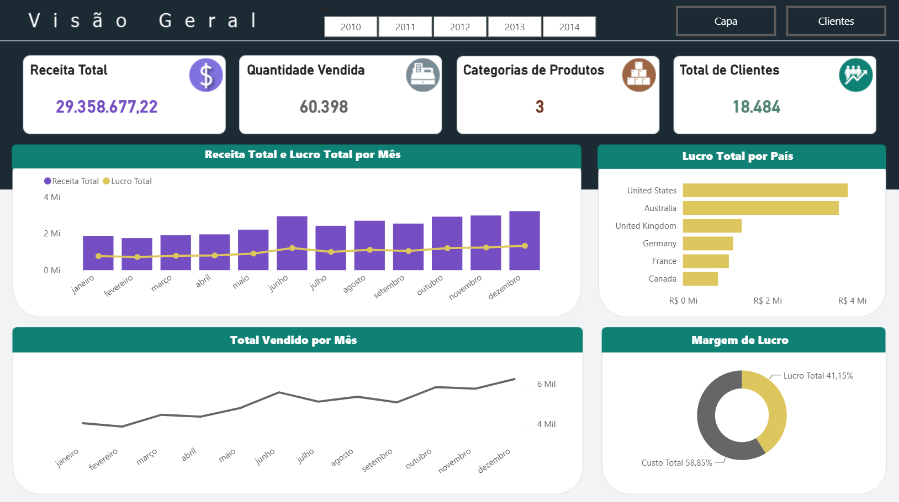
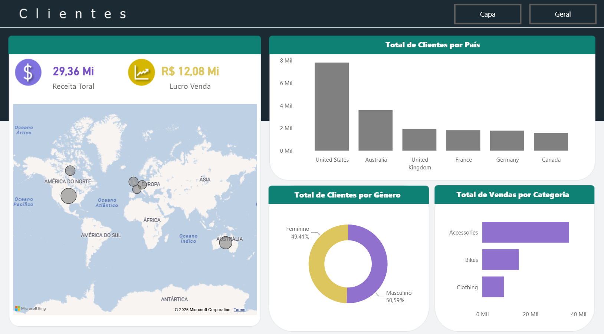

# 📊 Visão Global de Vendas Online: Dashboard Executivo em Power BI

*Análise 360° da performance de vendas do canal Internet (AdventureWorks) com SQL Server + Power BI*


> Segundo projeto de uma série usando o Data Warehouse **AdventureWorks**: dessa vez, um painel executivo completo — visão geral do negócio e recorte por perfil de cliente — construído em **Power BI**, com modelagem via T-SQL e medidas DAX. Veja também: [Dashboard AdventureWorks em Excel](https://github.com/otaviofabbro/adventureworks-sql-integracao-excel) (mesma fonte de dados, abordagem em Excel + Power Query).

🔗 [Ver Dashboard Publicado](https://app.powerbi.com/view?r=eyJrIjoiNzQ1MDFiMmEtNmE0MS00NDU1LTk2YjktYzRiYmEzMTU0YzBjIiwidCI6IjdlOTNlMjg2LWIyOWEtNDQ1NC1hNDFhLWU4NDE5ZWM5ZGViNSJ9&pageName=daccba536aaf8958b994)

---

## 📑 Sumário

- [Sobre o Projeto](#-sobre-o-projeto)
- [Indicadores Desenvolvidos](#-indicadores-desenvolvidos)
- [Preview do Dashboard](#️-preview-do-dashboard)
- [Tecnologias Utilizadas](#️-tecnologias-utilizadas)
- [Estrutura do Repositório](#-estrutura-do-repositório)
- [Como Reproduzir](#️-como-reproduzir)
- [Principais Insights](#-principais-insights)
- [Autor](#-autor)

---

## 📌 Sobre o Projeto

Este projeto expande a análise do canal *Internet Sales* do AdventureWorks para um painel executivo completo, dividido em duas frentes: uma **visão geral do negócio** (receita, volume, margem e sazonalidade) e uma **visão de clientes** (distribuição geográfica e comportamento de compra por perfil).

O fluxo do projeto segue a pipeline:

**SQL Server (modelagem)** → **T-SQL (VIEW consolidada)** → **Power BI (conexão + medidas DAX)** → **Dashboard (2 páginas interativas)**

Diferente do projeto irmão em Excel — focado em 4 KPIs pontuais — aqui o objetivo foi construir um **painel de gestão mais abrangente**, com granularidade de pedido (`RESULTADOS_ADW`) servindo de base para agregações calculadas diretamente no Power BI.

### 🎯 Objetivo

Praticar e demonstrar habilidades de BI de ponta a ponta:
- Modelagem de uma VIEW SQL consolidando múltiplas tabelas dimensionais em uma única fonte analítica
- Construção de medidas DAX para métricas de negócio (receita, lucro, margem)
- Organização de um dashboard em múltiplas páginas, com navegação por contexto (geral vs. cliente)
- Aplicação do mesmo Data Warehouse em uma ferramenta de BI diferente do primeiro projeto, evidenciando versatilidade técnica

---

## 📈 Indicadores Desenvolvidos

### Aba Geral — Visão Executiva

| # | Indicador | Pergunta de Negócio Respondida |
|---|-----------|----------------------------------|
| 1 | **Receita Total** | Qual o faturamento total do canal Internet? |
| 2 | **Quantidade Vendida** | Qual o volume total de itens vendidos? |
| 3 | **Total de Categorias de Produtos** | Qual a amplitude do catálogo ativo em vendas? |
| 4 | **Quantidade de Clientes** | Qual o tamanho da base de clientes que compra online? |
| 5 | **Receita Total e Lucro Total por Mês** | Como receita e lucro evoluem ao longo do ano? Há sazonalidade? |
| 6 | **Margem de Lucro** | Qual a rentabilidade percentual das vendas? |
| 7 | **Quantidade Vendida por Mês** | O volume acompanha os picos de receita? |
| 8 | **Lucro por País** | Quais mercados são mais lucrativos, não só mais volumosos? |

### Aba Clientes — Perfil e Geografia

| # | Indicador | Pergunta de Negócio Respondida |
|---|-----------|----------------------------------|
| 9 | **Vendas por País** | Onde estão concentradas as vendas? |
| 10 | **Clientes por País** | Onde está concentrada a base de clientes? |
| 11 | **Vendas por Gênero** | Existe diferença de comportamento de compra entre perfis de cliente? |
| 12 | **Vendas por Categoria** | Quais categorias têm maior aceitação entre os clientes? |

Todos os indicadores partem da VIEW [`RESULTADOS_ADW`](./sql), que consolida pedido, produto, cliente, gênero, país, quantidade, receita, custo e lucro em uma única fonte — as agregações (somas, médias, percentuais) foram calculadas via medidas DAX diretamente no modelo do Power BI.

---

## 🖼️ Preview do Dashboard






---

## 🛠️ Tecnologias Utilizadas

- **SQL Server** — armazenamento e modelagem dos dados (AdventureWorks)
- **T-SQL** — criação da VIEW consolidada `RESULTADOS_ADW`
- **Power BI Desktop** — modelagem do relatório e construção do dashboard
- **DAX** — medidas de agregação e cálculo de indicadores (receita, lucro, margem)
- **Git & GitHub** — versionamento e portfólio

---

## 📂 Estrutura do Repositório

```
adventureworks-powerbi-dashboard/
├── docs/
│    ├── images/
│    │     ├── layout-powerpoint/
│    │     │          ├── capa.png
│    │     │          ├── clientes.png
│    │     │          └── geral.png
│    │     └── prints-dashboard
│    │                ├── print_capa.png
│    │                ├── print_clientes.png
│    │                └── print_geral.png
│    └── ppt/
│         └── planos_de_fundo_dashboard.pptx
│
├── powerbi/
│   └── dashboard_adventureworks2025.pbix
│
├── sql/
│   ├── 1.deficao_escopo_projeto.sql
│   ├── 2.colunas_e_tabelas_projeto.sql
│   └── 3.VIEW_resultados
│
├── LICENSE
└── README.md
```

📁 [`/sql`](./sql) · 📁 [`/powerbi`](./powerbi) · 📁 [`/docs`](./docs)

---

## ⚙️ Como Reproduzir

1. Baixe e restaure o banco **AdventureWorks** (versão OLTP ou DW) a partir do [repositório oficial da Microsoft](https://github.com/Microsoft/sql-server-samples/releases).
2. Execute o script [`/sql`](./sql) no SQL Server Management Studio (SSMS) para criar a VIEW `RESULTADOS_ADW`.
3. Abra o arquivo [`dashboard_adventureworks2025.pbix`](./powerbi) no Power BI Desktop.
4. Em **Página Inicial > Transformar Dados > Configurações da Fonte de Dados**, atualize a conexão para apontar para a sua instância local do SQL Server.
5. Clique em **Atualizar** para carregar os dados e explore as duas páginas do dashboard.

---

## 💡 Principais Insights

> Substitua pelos achados reais do seu dashboard.

- A receita total do canal Internet em 2013 foi de **[valor]**, com margem de lucro média de **[X]%**.
- O mês de **[mês]** concentrou o maior volume de vendas, indicando **[possível causa/sazonalidade]**.
- O país **[Y]** lidera em lucro absoluto, mesmo não sendo o de maior volume — sinal de **[maior margem/menor custo logístico/etc.]**.
- O perfil de cliente **[M/F]** representa a maior fatia das vendas, mas a diferença entre gêneros é **[pequena/relevante]**.

---

## 👤 Autor

<div align="center">
<table>
  <tr>
    <td align="center">
      <b>Otávio Fabbro Machado</b><br/>
      Bacharel em Ciências Sociais (FFLCH-USP)<br/>
      Especialista em Ciência de Dados (ICMC-USP)<br/><br/>
      <a href="https://www.linkedin.com/in/otaviofabbrodata">
        
      </a>
      <a href="https://github.com/otaviofabbro">
        
      </a>
      <a href="mailto:otaviofabbro2@gmail.com">
        
      </a>
    </td>
  </tr>
</table>

</div>

---

## 📄 Licença

Este projeto está sob a licença MIT — veja o arquivo [LICENSE](./LICENSE) para mais detalhes.
